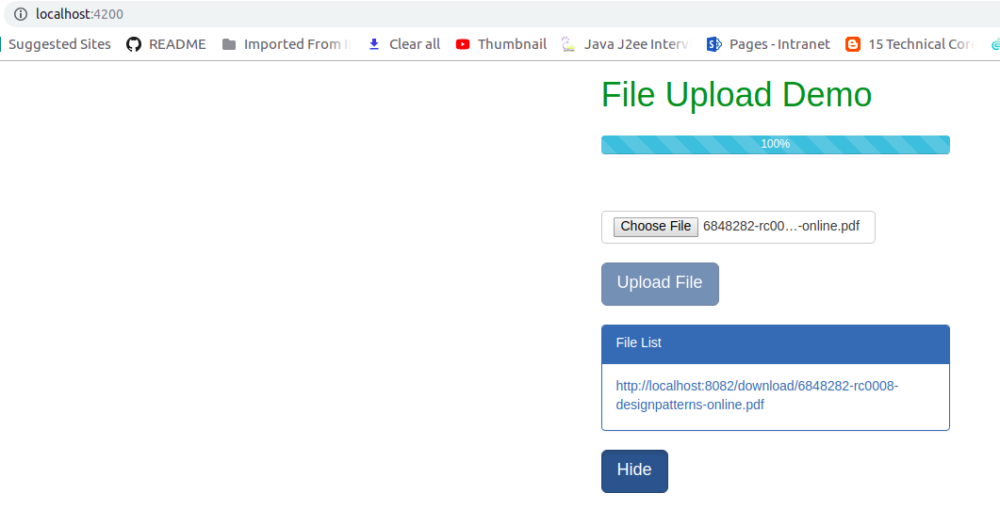

# springboot-angular-fileupload-demoo
This project explains do file upload and download using spring boot and angular.

### Application


### Springboot changes

**FileUploadController.java**

``
@Controller
public class FileUploadController {

    @Autowired
    private FileUploadService fileUploadService;

    List<String> fileNames = new ArrayList<String>();

    @PostMapping("/upload")
    public ResponseEntity<String> fileUpload(@RequestParam("file")MultipartFile file) {
        fileUploadService.storeFile(file);
        fileNames.add(file.getOriginalFilename());
        String msg = "File " + file.getOriginalFilename() + " uploaded successfully";
        return ResponseEntity.status(HttpStatus.OK).body(msg);
    }


    @GetMapping("/getFiles")
    public ResponseEntity<List<String>> getFile(Model model) {
        List<String> files = fileNames
                .stream()
                .map(fileName -> MvcUriComponentsBuilder.fromMethodName(FileUploadController.class, "getFileByName", fileName).build().toString())
                .collect(Collectors.toList());
        return ResponseEntity.ok().body(files);
    }

    @GetMapping("/download/{fileName:.+}")
    @ResponseBody
    public ResponseEntity<Resource> getFileByName(@PathVariable String fileName) {
        Resource file = fileUploadService.loadFile(fileName);
        return ResponseEntity.ok()
                .header(HttpHeaders.CONTENT_DISPOSITION, "attachment; filename=\"" + file.getFilename() + "\"")
                .body(file);
    }

}

``

**FileuploadService.java**

```
@Service
public class FileUploadService {

    private final Path location = Paths.get("upload");

    public void storeFile(MultipartFile multipartFile) {
        try {
            Files.copy(multipartFile.getInputStream(), this.location.resolve(multipartFile.getOriginalFilename()));
        }catch (Exception e) {
            throw new RuntimeException("Failed");
        }
    }


    public Resource loadFile(String fileName) {
        try{

            Path file = location.resolve(fileName);
            Resource resource = new UrlResource(file.toUri());
            if(resource.exists() || resource.isReadable()) {
                return  resource;
            } else {
                throw new RuntimeException("Failed");
            }
        } catch (MalformedURLException e) {
            throw new RuntimeException("Failed");
        }
    }

    public void deleteAll() {
        FileSystemUtils.deleteRecursively(location.toFile());
    }

    public void init() {
        try {
            Files.createDirectory(location);
        } catch (IOException e) {
            throw new RuntimeException("Could not initialize storage!");
        }
    }
    
}

```

**application.properties**
```
server.port=8082
spring.servlet.multipart.max-file-size=800KB
spring.servlet.multipart.max-request-size=800KB
```

### Angular changes

**upload-file.service.ts**

```
import { Injectable } from '@angular/core';
import { HttpClient, HttpEvent, HttpRequest } from '@angular/common/http';
import { Observable } from 'rxjs';

@Injectable({
  providedIn: 'root'
})
export class UploadFileService {
  constructor(private http: HttpClient) {}

  uploadFiles(file: File): Observable<HttpEvent<{}>> {
    const formData: FormData = new FormData();
    formData.append('file', file);
    const request = new HttpRequest('POST', '/upload', formData, {
      reportProgress: true,
      responseType: 'text'
    });
    return this.http.request(request);
  }

  getFiles(): Observable<any> {
    return this.http.get('/getFiles');
  }
}


```

### Screenshot




### Happy coding